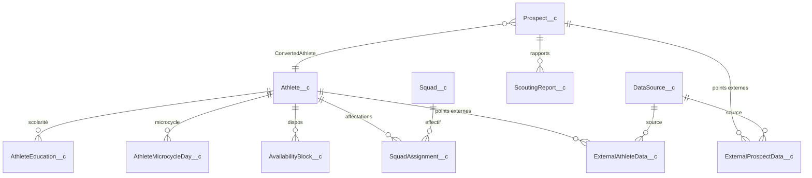

# Présentation équipe — Salesforce, CRM & projet Sport Cloud 360

**Public** : onboarding de contributeurs non techniques (famille / renfort projet).  
**Objectif** : comprendre Salesforce et le CRM, situer le marché, saisir le modèle de données du projet, puis la liste des **configurations manuelles et fonctionnelles** à réaliser ou valider dans l’environnement actuel.

---

## Table des matières

1. [Qu’est-ce que Salesforce ?](#1-quest-ce-que-salesforce)
2. [Qu’est-ce qu’un CRM ?](#2-quest-ce-quun-crm)
3. [Objectifs typiques d’un CRM](#3-objectifs-typiques-dun-crm)
4. [Place de Salesforce sur le marché](#4-place-de-salesforce-sur-le-marché)
5. [Comment Salesforce structure les données (vue simple)](#5-comment-salesforce-structure-les-données-vue-simple)
6. [Modèle de données du projet (repo actuel)](#6-modèle-de-données-du-projet-repo-actuel)
7. [Le projet : Sports Intelligence Cloud / Athlete Core 360](#7-le-projet--sports-intelligence-cloud--athlete-core-360)
8. [Applications Lightning livrées dans le code](#8-applications-lightning-livrées-dans-le-code)
9. [Configurations manuelles & fonctionnelles à faire aujourd’hui](#9-configurations-manuelles--fonctionnelles-à-faire-aujourdhui)
10. [Documents du repo à utiliser comme référence](#10-documents-du-repo-à-utiliser-comme-référence)

---

## 1. Qu’est-ce que Salesforce ?

**Salesforce** est une plateforme **cloud** qui permet de gérer la relation client (ventes, service, marketing) et, au fil des années, un écosystème beaucoup plus large : données analytiques, intégrations, applications métier personnalisées, et couches **IA** (dont Agentforce sur les offres récentes).

Dans la pratique, une **organisation Salesforce** (« org ») contient :

| Concept | Rôle |
|--------|------|
| **Données** | Enregistrements stockés dans des **objets** (tables logiques), ex. Contact, Account, ou objets custom `Athlete__c`. |
| **Interface** | **Lightning Experience** : listes, fiches détail, applications, composants. |
| **Sécurité** | Profils, **Permission Sets**, partage des enregistrements. |
| **Automatisation** | Flows, règles, Apex (code), événements plateforme. |
| **Déploiement** | Métadonnées versionnées (comme ce dépôt) puis déployées vers une org de test ou production. |

**Data Cloud** (anciennement CDP) est un produit Salesforce pour unifier des données multi-sources, calculer des **Golden Records** et alimenter des activations — c’est le cœur du pipeline « données externes → Core » dans notre projet.

---

## 2. Qu’est-ce qu’un CRM ?

Un **CRM** (*Customer Relationship Management*) est un système qui centralise :

- les **personnes et organisations** (clients, prospects, partenaires) ;
- les **interactions** (emails, appels, réunions, tickets) ;
- les **opportunités commerciales** et l’historique ;
- souvent le **parcours** du lead jusqu’à la fidélisation.

L’idée : **une seule source de vérité** pour les équipes commerciales et support, avec des processus traçables.

---

## 3. Objectifs typiques d’un CRM

- **Visibilité 360°** sur le client ou le partenaire.
- **Productivité** : moins de ressaisie, tâches et relances guidées.
- **Pilotage** : tableaux de bord, prévisions, SLA.
- **Conformité & traçabilité** : qui a vu quoi, quand.
- **Orchestration** : relier marketing, ventes et service sur le même référentiel.

Dans **notre** projet, on transpose cette logique au monde **sport / performance / scouting** : l’« athlète » ou le « prospect » joue un rôle comparable au « client » dans un CRM classique, avec des objets et des flux adaptés.

---

## 4. Place de Salesforce sur le marché

En synthèse (niveau marché, pas secret industriel) :

- **Leader historique du CRM cloud** : très large base installée, fort écosystème d’intégrateurs et d’AppExchange.
- **Plateforme** : au-delà du CRM pur, Salesforce vend des clouds (Sales, Service, Marketing, **Data Cloud**, etc.) et des outils de développement (Apex, LWC).
- **Concurrence** : Microsoft Dynamics, HubSpot, Zoho, SAP CX, etc. — le positionnement de Salesforce reste **dominant sur le segment CRM enterprise cloud** dans les études type Gartner / IDC (à consulter pour les chiffres à jour).

**Pour nous** : choix cohérent avec un produit **ISV** ou partenaire sur Salesforce, Data Cloud pour le **Golden Record**, et **Agentforce** pour des agents IA branchés sur les données Core.

---

## 5. Comment Salesforce structure les données (vue simple)

- **Objet standard** : fourni par Salesforce (Lead, Opportunity…).
- **Objet custom** : défini par le projet, suffixe `__c` (ex. `Athlete__c`).
- **Champs** : texte, nombre, date, lookup (relation vers un autre enregistrement), etc.
- **Relation** : souvent **lookup** (optionnel) ou **master-detail** (dépend fort du parent).
- **Événement plateforme** : message asynchrone (ex. `AthleteFeatureUpdate__e`) pour découpler Data Cloud / calculs et mise à jour Core.

Sans entrer dans le détail technique : **tout ce que vous voyez dans l’UI** (onglets, mises en page, applications) est relié à ces objets et champs.

---

## 6. Modèle de données du projet (repo actuel)

### 6.1 Principe

- **Pivot performance / médical / planning** : **`Athlete__c`** (fiche athlète).
- **Pivot scouting / recrutement** : **`Prospect__c`**, avec possibilité de lien vers un athlète converti (`ConvertedAthlete__c`).
- **Données externes / lake** : **`ExternalAthleteData__c`**, **`ExternalProspectData__c`**, référence **`DataSource__c`**.
- **Planning club** : **`PlanningEvent__c`**, **`Resource__c`**, **`Booking__c`**, **`AvailabilityBlock__c`**, microcycles (`Microcycle__c`, `MicrocycleDay__c`, `AthleteMicrocycleDay__c`).
- **Éducation / scolaire** : **`AthleteEducation__c`**, **`EducationReport__c`**, **`SchoolAbsence__c`**.
- **Scouting** : **`ScoutingReport__c`**, **`ScoutingSnapshot__c`**, **`Match__c`**.
- **Effectif** : **`Squad__c`**, **`SquadAssignment__c`**.
- **Événements** (async) : **`AthleteFeatureUpdate__e`**, **`ProspectFeatureUpdate__e`**.

### 6.2 Schéma simplifié (Mermaid)

### 6.3 Clé d’identité Data Cloud → Core

- **`Athlete__c.ExternalId__c`** et **`Prospect__c.ExternalId__c`** : identifiants stables pour **Identity Resolution**, activation et upsert sans doublons.  
- Les **mappings** détaillés champs par champs sont dans `project-management/DataCloud_Activation_Mapping_Athlete.csv` et `DataCloud_Activation_Mapping_Scouting.csv`.

---

## 7. Le projet : Sports Intelligence Cloud / Athlete Core 360

**Vision MVP** : une **application Salesforce** (ou plusieurs apps Lightning) qui donne une vue **360° sport** — performance, charge, risque, santé, scouting — avec :

1. **Données Core** : objets custom et relations ci-dessus.
2. **Data Cloud** : harmonisation, **Golden Record**, features calculées (readiness, ACWR, scores scouting…).
3. **Activation** : mise à jour des champs `Athlete__c` / `Prospect__c` depuis les lake objects / calculs (cf. CSV de mapping).
4. **IA (Agentforce)** : prompts type **résumé athlète**, **alerte risque**, **recommandation scouting** — contenus dans `Sprint3_PromptPack.md`.
5. **Automatisation** : flows d’**alerte** (seuils injury risk, ACWR), anti-spam éventuel.

**Storyline démo** (rappel checklist Sprint 3) : *Data Cloud → événement → Core → IA → action*.

---

## 8. Applications Lightning livrées dans le code

Dans le dépôt, les métadonnées déclarent notamment :

| Application | Rôle |
|-------------|------|
| **Athlete_360** | Vue athlète / performance / 360. |
| **Scouting_360** | Vue recrutement / prospects. |
| **Medical_360** | Vue médical / santé. |
| **Club_360** | Vue club / planning / organisation. |

Les **Permission Sets** (ex. `SportCloud_Admin`) exposent ces apps aux bons utilisateurs — à assigner dans l’org.

---

## 9. Configurations manuelles & fonctionnelles à faire aujourd’hui

Ci-dessous : synthèse **agrégée** des checklists Sprints 1–4 et runbooks (ce qui est **dans l’org** ou **Data Cloud**, pas seulement le déploiement de code).

### 9.1 Données de base & qualité identité

- [ ] **Jeu de données minimal** : squads, athlètes, prospects, affectations (volumes indicatifs Sprint 1 : 6 squads, 10 athlètes, 10 prospects, 15 affectations).
- [ ] **`ExternalId__c` rempli** sans valeur nulle sur les cibles athlète + prospect ; **aucun doublon** sur cet identifiant.
- [ ] Cohérence **Data Cloud ↔ Core** : requêtes de contrôle (voir `Sprint3_AI_Automation_Runbook.md`).

### 9.2 Data Cloud (hors repo, console Salesforce)

- [ ] **Sources / ingest** : paramétrage des connecteurs ou fichiers (ex. jeux mock, tokens API si applicable — cf. Sprint 2).
- [ ] **Features** calculées (athlète + prospect) alignées avec les CSV de mapping.
- [ ] **Data Actions / activation** : publication stable vers `Athlete__c` et `Prospect__c` ; timestamps `LastTrainingSync__c`, `LastMatchSync__c`, `LastDataCloudSync__c` alimentés.
- [ ] **Plan de refresh** (intraday entraînement, daily scouting) documenté et respecté.

### 9.3 UX — mises en page & pages Lightning

- [ ] **Layouts** `Athlete__c` et `Prospect__c` : sections, champs critiques, **listes associées** visibles.
- [ ] **Lightning Record Pages** : si usage des LWC premium (Sprint 4), ouvrir App Builder, placer les composants (`sc360AthletePage`, `sc360App`, etc.), choisir thème (`darkPro`, `lightMinimal`, `neonSport` selon runbook).
- [ ] **Home** : flexipages `Athlete_360_Home`, `Scouting_360_Home` déjà dans le projet — vérifier qu’elles sont assignées aux apps dans l’org.

### 9.4 Sécurité — Permission Sets & accès

- [ ] Assigner les jeux de droits prévus : **`SportCloud_Admin`**, **`Coach_Read`**, **`Scout_Editor`**, **`Recruiter_Editor`**, **`Planning_Editor`** (et vérifier visibilité des apps Lightning).
- [ ] Tests par **persona** : coach (lecture), scout / recruteur (édition scouting), planning (édition planning).

### 9.5 Automatisation — Flows & alertes

- [ ] **Flow alerte injury** : `InjuryRiskScore__c >= 75`.
- [ ] **Flow alerte charge (ACWR)** : `Acwr__c > 1.5` ou `< 0.8`.
- [ ] **Notification** vers le rôle cible (Coach / Medical / Recruiter) + **dédoublonnage** (ex. pas deux fois la même alerte en 24h sur le même athlète).
- [ ] Cas de test : positif injury, positif ACWR, négatif (pas d’alerte).

### 9.6 IA — Agentforce / prompts

- [ ] Créer ou importer les **prompts** (contenu dans `Sprint3_PromptPack.md`) :
  - **Athlete Summary**
  - **Risk Alert**
  - **Scouting Recommendation**
- [ ] Paramètres recommandés : température **0.2–0.4**, max tokens **~220**, **grounding** uniquement sur les champs fournis.
- [ ] **Critères d’acceptation** : réponse ≤ 6 lignes, max 2 actions, pas d’invention de champs, décision explicite.
- [ ] Jeu d’évaluation : `Sprint3_PromptEval_Set.csv`.

### 9.7 Règles métier & intégrations déjà prévues dans les sprints

- [ ] **Conversion Prospect → Athlete** opérationnelle.
- [ ] **Calendrier planning** : création / MAJ / suppression `PlanningEvent__c` ↔ `Event` Salesforce (Sprint 1).
- [ ] **Validations** dates et anti-chevauchement (selon implémentation).

### 9.8 Monitoring & exploitation

- [ ] **Dashboard** (latence sync, échecs, couverture) — KPI `LastDataCloudSync__c` monitorable.
- [ ] **Procédure incident** : replay événement, ré-ingestion (voir `Sprint3_AI_Automation_Runbook.md` section T4).
- [ ] **Runbook** partagé : un autre membre peut exécuter la checklist incident.

### 9.9 QA / recette

- [ ] Sprint 3 : 5 cas athlète, 5 cas prospect, cas négatif (external id absent), cas limites (nulls, bornes).
- [ ] **Démo** : script &lt; 10 min, zéro blocker P1/P2.

---

## 10. Documents du repo à utiliser comme référence

| Fichier | Contenu |
|---------|---------|
| `Sprint1_Execution_Checklist.md` | Données, layouts, planning, permission sets, QA. |
| `Sprint2_Execution_Checklist.md` + `Sprint2_DataCloud_Runbook.md` | Data Cloud, features, activation. |
| `Sprint3_Execution_Checklist.md` + `Sprint3_AI_Automation_Runbook.md` | Identité, alertes, prompts, monitoring. |
| `Sprint3_PromptPack.md` | Textes prompts IA prêts à copier-coller. |
| `Sprint4_UI_Revamp_Runbook.md` | Composants LWC, App Builder, thèmes. |
| `DataCloud_Activation_Mapping_Athlete.csv` / `..._Scouting.csv` | Mapping activation champ par champ. |

---

## Sources (marché & produit)

- [Salesforce — Qu’est-ce que le CRM ?](https://www.salesforce.com/crm/what-is-crm/) (vue officielle produit).
- [Gartner Magic Quadrant for Sales Force Automation](https://www.gartner.com/) — consulter l’édition la plus récente pour le classement fournisseurs.
- Documentation Salesforce Developer & Help : [developer.salesforce.com](https://developer.salesforce.com), [help.salesforce.com](https://help.salesforce.com).

---

*Document généré pour l’onboarding équipe — Sport Cloud 360. À mettre à jour quand une checklist sprint est bouclée ou qu’une nouvelle config manuelle apparaît.*
