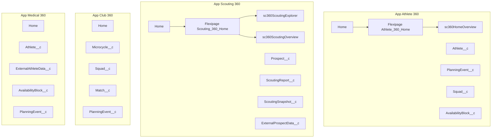
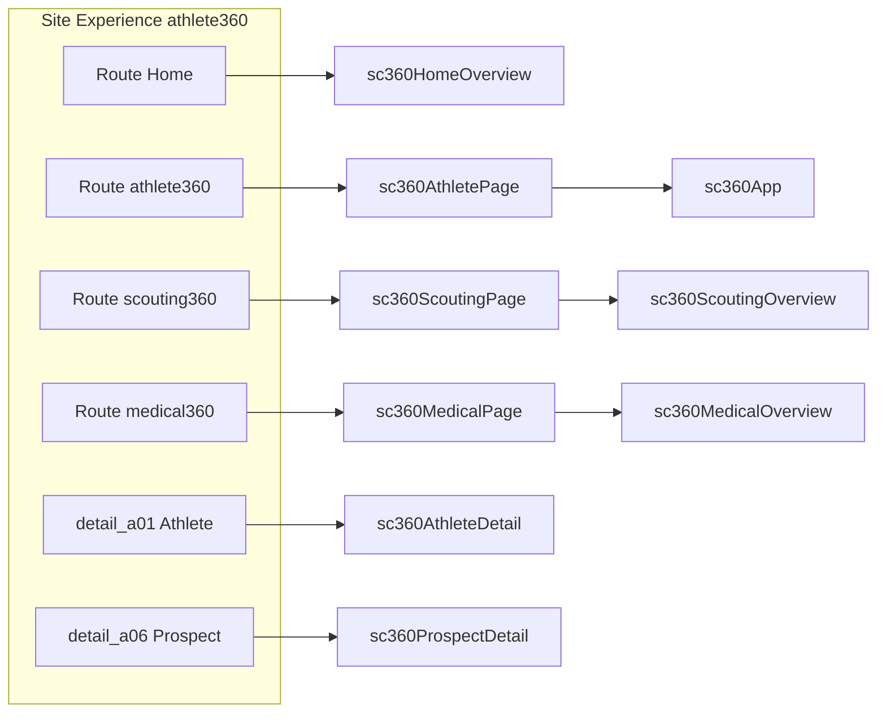
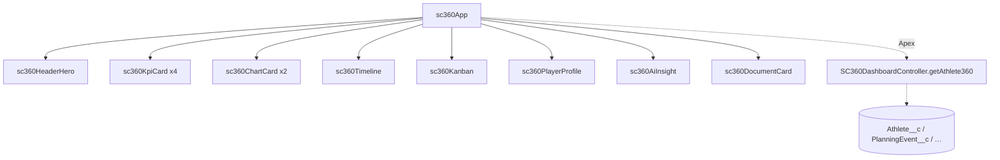
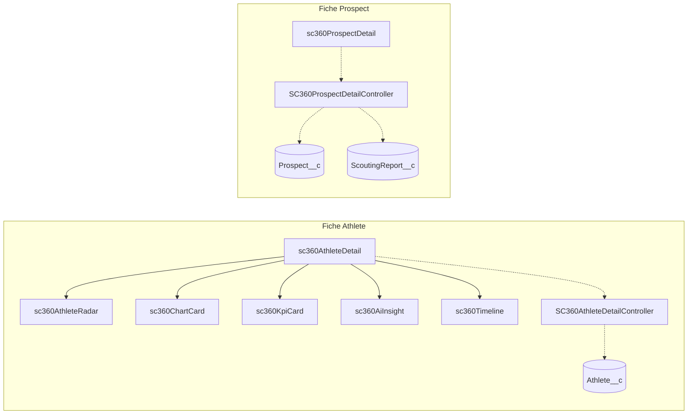
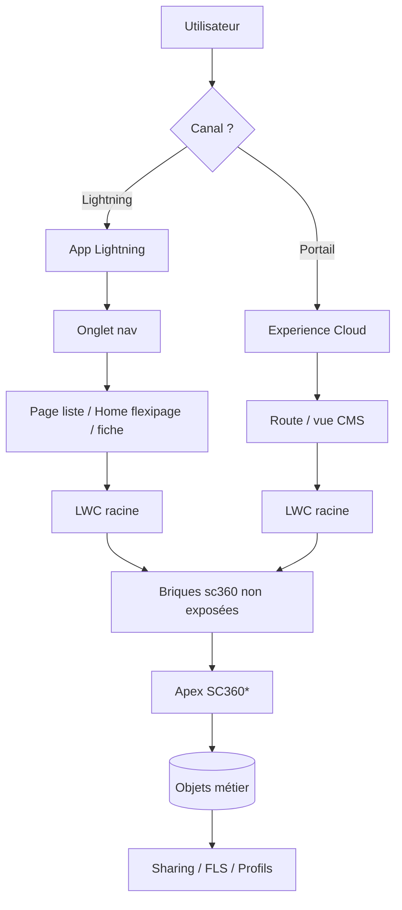

# Sports Intelligence Cloud — Architecture navigation & LWC

> **Périmètre actuel (projet)** : utilisation **Lightning (Salesforce core)** — **Experience Cloud n’est pas utilisé pour l’instant**. Les sections et diagrammes liés au site portail restent une **référence metadata** (`digitalExperiences/`) pour une réactivation ultérieure.

Document généré à partir du dépôt (`force-app/main/default`). Les **préfixes d’ID** (`a01`, `a06`, `a07`) dans le bundle Experience **reflètent l’org où le site a été créé** ; en cas de nouvelle org, vérifier **Setup → Object Manager** pour l’équivalence exacte. Ici on les mappe aux objets métier du modèle SC360.

---

## Légende

| Colonne | Signification |
|--------|----------------|
| **App** | Application Lightning personnalisée (`applications/*.app-meta.xml`) |
| **Onglet (nav)** | Onglet dans la barre latérale de l’app |
| **Page** | Page d’accueil d’app, liste, fiche enregistrement, ou page Experience |
| **Onglets / zones UI** | Onglets internes LWC (`lightning-tabset` ou tabs custom) ou sections |
| **LWC (racine)** | Composant placé sur la page ou wrapper principal |
| **Sous-composants** | Briques non exposées utilisées par le racine |
| **Fonctionnalité** | Rôle métier |
| **Permissions / données** | Objets + contrôleurs Apex (`with sharing`) ; profils / permission sets internes *(Experience : si réactivation du portail)* |
| **Objets** | Objets Salesforce concernés |

**Apex (référence)** : les contrôleurs `SC360*` sont en `with sharing`. Les **Permission Sets** du repo (`SportCloud_Admin`, `Coach_Read`, `Planning_Editor`, …) couvrent surtout **apps + objets** ; l’accès **classe Apex** doit être ajouté sur les profils / perm sets dans l’org si nécessaire (non listé exhaustivement dans le XML actuel).

---

## 1. Salesforce Lightning — Applications & onglets

### 1.1 App **Athlete 360** (`Athlete_360`)

| Onglet (nav) | Page | Onglets / zones UI | LWC (racine) | Sous-composants | Fonctionnalité | Permissions / données | Objets |
|--------------|------|--------------------|--------------|-----------------|----------------|------------------------|--------|
| **Home** (`standard-home`) | App Home — flexipage **Athlete_360_Home** | — | `sc360HomeOverview` | `sc360KpiCard`, `sc360ChartCard`, `sc360Timeline`, `sc360AiInsight` | Vue club : KPI agrégés, répartitions, data quality, timeline | `SC360HomeController` | `Athlete__c`, `PlanningEvent__c`, etc. (agrégats) |
| **Athlete** | Liste / **Fiche Athlete** | selon mise en page Lightning | *Optionnel* : `sc360AthleteHome` (record) ou flexipage record custom | idem + briques prototype | Dashboard athlète « premium » ou 360 classique | Record `recordId` + Apex dédié (à brancher) | `Athlete__c` |
| **PlanningEvent** | Listes / fiches | — | standard ou custom | — | Planning | CRUD selon profil | `PlanningEvent__c` |
| **Squad** | Listes / fiches | — | standard | — | Effectifs | CRUD selon profil | `Squad__c` |
| **AvailabilityBlock** | Listes / fiches | — | standard | — | Disponibilités | CRUD selon profil | `AvailabilityBlock__c` |

### 1.2 App **Club 360** (`Club_360`)

| Onglet (nav) | Page | LWC (racine) | Fonctionnalité | Objets |
|--------------|------|--------------|----------------|--------|
| Home | *Pas de flexipage SC360 dédiée dans le repo* | — | Home standard ou à configurer | — |
| Microcycle / Squad / Match / PlanningEvent | Listes & fiches | standard | Microcycles, effectif, matchs, planning | `Microcycle__c`, `Squad__c`, `Match__c`, `PlanningEvent__c` |

### 1.3 App **Medical 360** (`Medical_360`)

| Onglet (nav) | Page | LWC (racine) | Fonctionnalité | Objets |
|--------------|------|--------------|----------------|--------|
| Home | standard | — | — | — |
| Athlete / ExternalAthleteData / AvailabilityBlock / PlanningEvent | Listes & fiches | standard | Suivi santé, données externes | `Athlete__c`, `ExternalAthleteData__c`, `AvailabilityBlock__c`, `PlanningEvent__c` |

### 1.4 App **Scouting 360** (`Scouting_360`)

| Onglet (nav) | Page | Onglets / zones UI | LWC (racine) | Sous-composants | Fonctionnalité | Permissions / données | Objets |
|--------------|------|--------------------|--------------|-----------------|----------------|------------------------|--------|
| **Home** | App Home — flexipage **Scouting_360_Home** | 2 composants empilés | `sc360ScoutingExplorer`, `sc360ScoutingOverview` | (overview) charts, map selon implémentation | Exploration prospects + vue agrégée scouting | `SC360ScoutingExplorerController`, `SC360ScoutingController` | `Prospect__c`, `ScoutingReport__c`, … |
| **Prospect / ScoutingReport / ScoutingSnapshot / ExternalProspectData** | Listes & fiches | — | standard | — | Pipeline scouting | CRUD selon profil | `Prospect__c`, `ScoutingReport__c`, `ScoutingSnapshot__c`, `ExternalProspectData__c` |

---

## 2. Experience Cloud — Site **Athlete360** *(hors périmètre actuel — référence)*

> **Non utilisé pour l’instant.** Le bundle ci-dessous reste versionné pour ne pas perdre la config (routes, vues, LWC injectés).

URL de site (metadata) : `athlete360`. Navigation standard LWR + vues CMS.

### 2.1 Pages « hub » (routes custom)

| Route / vue (metadata) | URL typique | LWC (racine) | Sous-composants / logique | Fonctionnalité | Objets |
|------------------------|-------------|--------------|---------------------------|----------------|--------|
| **Home** | `/` | `sc360HomeOverview` | KPI, charts, timeline, IA | Accueil club portal | Agrégats multi-athlètes |
| **Athlete360** (`athlete360`) | `/athlete360` | `sc360AthletePage` → **`sc360App`** | `sc360HeaderHero`, `sc360KpiCard`, `sc360ChartCard`, `sc360Timeline`, `sc360Kanban`, `sc360PlayerProfile`, `sc360AiInsight`, `sc360DocumentCard` | Dashboard Athlete 360 (thème reset) | `Athlete__c` via `recordId` sur page record ou contexte |
| **Scouting360** | `/scouting360` | `sc360ScoutingPage` → **`sc360ScoutingOverview`** | charts, cartographie si présent | Vue scouting portail | `Prospect__c` |
| **Medical360** | `/medical360` | `sc360MedicalPage` → **`sc360MedicalOverview`** | KPI / santé | Vue médicale agrégée | `Athlete__c` |
| **Training / Admin** (wrappers) | selon config Builder | `sc360TrainingPage` / `sc360AdminPage` → **`sc360App`** | idem `sc360App` | Variantes `pageType` | `Athlete__c` |

### 2.2 Pages **fiche enregistrement** (record)

| Vue bundle | Objet métier (mapping logique) | LWC (racine) | Onglets / zones UI | Fonctionnalité | Apex | Objets |
|------------|-------------------------------|--------------|--------------------|----------------|------|--------|
| `detail_a01` | **Athlete__c** | `sc360AthleteDetail` | `lightning-tabset` : Overview (KPI, charts, **`sc360AthleteRadar`**) ; Medical (`sc360AiInsight`, `sc360Timeline`) | Détail athlète enrichi | `SC360AthleteDetailController`, `SC360AthleteRadarController` | `Athlete__c`, `PlanningEvent__c` (timeline), etc. |
| `detail_a06` | **Prospect__c** | `sc360ProspectDetail` | Overview ; **Scouting Process** (formulaire étapes) ; historique | Workflow scouting 5 étapes, sauvegarde rapports | `SC360ProspectDetailController` | `Prospect__c`, `ScoutingReport__c` |
| `detail_a07` | *Objet lié bundle (souvent événement / planning)* | *(pas de LWC SC360 dans le JSON listé)* | — | Détail standard ou à compléter | — | *Vérifier org* |

### 2.3 Listes & autres

| Vue | LWC SC360 | Note |
|-----|-----------|------|
| `Athlete_Liste`, `Prospect_Liste`, `Athlete_Education_Liste` | Standard list | Pas de composant SC360 racine dans le grep |
| `managed_content_sfdc_cms_news` | `sc360AthletePage` | Démo / contenu CMS |
| Login, Register, Error, … | Standard Experience | — |

---

## 3. Composant **`sc360App`** (cœur dashboard Athlete)

Utilisé par `sc360AthletePage`, `sc360TrainingPage`, `sc360AdminPage` avec `page-type` et `theme`.

| Zone UI | Sous-composants | Fonctionnalité | Apex | Objets |
|---------|-----------------|----------------|------|--------|
| Header | `sc360HeaderHero` | Titre, sync, badge | Données profil dans DTO | `Athlete__c` |
| Colonne gauche | `sc360KpiCard` ×4, `sc360ChartCard` ×2, `sc360Timeline`, `sc360Kanban` | Charge, readiness, planning, board | `SC360DashboardController.getAthlete360` | `Athlete__c`, `PlanningEvent__c`, … |
| Colonne droite | `sc360PlayerProfile`, `sc360AiInsight`, `sc360DocumentCard` | Profil, IA, fichiers | idem | + Content / pièces jointes |

---

## 4. Composants exposés « standalone » (hors chaîne ci-dessus)

| LWC | Cible principale | Fonctionnalité | Apex | Objets |
|-----|------------------|----------------|------|--------|
| `sc360AthleteHome` | Record / App / Community | Nouvelle UI prototype Athlete (hero, KPI strip, 4 onglets, IA) | *Mock / TODO `getAthleteHome`* | `Athlete__c` |
| `sc360AthleteRadar` | Record / App | Radar performance | `SC360AthleteRadarController` | `Athlete__c` + stats |
| `sc360ProspectCompare` | App / Home | Comparaison prospects | `SC360ProspectCompareController` | `Prospect__c` |

---

## 5. Permissions — rappel opérationnel

| Couche | À configurer |
|--------|----------------|
| **Objets / FLS** | Permission sets type `SportCloud_Admin` + sets métiers (`Coach_Read`, `Planning_Editor`, …) |
| **Applications** | Visibilité des 4 apps Lightning |
| **Experience Cloud** | *(si portail réactivé)* Profil utilisateur site + **Sharing Sets** pour `Athlete__c` / `Prospect__c` / `ScoutingReport__c` |
| **Apex** | Accès aux classes `SC360*` sur le profil Experience (ou permission set) |
| **LWC** | Composants déployés + cibles `js-meta.xml` (Community Page, Record Page, …) |

---

## 6. Synthèse chaîne « App → Page → LWC »

```
Lightning App (Athlete_360 | Club_360 | Medical_360 | Scouting_360)
    └── Onglet Home / Objet…
            └── Flexipage App Home (si défini) OU liste standard OU fiche
                    └── LWC racine (ex. sc360HomeOverview, sc360App, …)
                            └── Briques sc360* (non exposées)

Experience Cloud (site athlete360)
    └── Route (Home | athlete360 | scouting360 | medical360 | detail_*)
            └── LWC racine (sc360HomeOverview | sc360AthletePage | …)
                    └── sc360App / sc360ScoutingOverview / sc360MedicalOverview / sc360AthleteDetail | sc360ProspectDetail
```

---

## 7. Diagrammes Mermaid

**À privilégier sans portail** : **7.1**, **7.3**, et la partie **Lightning** de **7.5**. Les diagrammes **7.2** et **7.4** (fiches record Experience) ne concernent le flux actuel que si tu réactives le site.

### 7.1 Applications Lightning — onglets → pages d’accueil (flexipages)



### 7.2 Experience Cloud — routes → LWC racine *(optionnel / portail)*



### 7.3 Décomposition `sc360App` (briques internes)



### 7.4 Fiches record Experience — objets + Apex



### 7.5 Chaîne logique « couche » (vue d’ensemble)



---

*Fin du document — périmètre Lightning : flexipages, record pages Lightning App Builder, et LWC `lightning__RecordPage`. Réactiver Experience Cloud : reprendre section 2 + diagrammes 7.2 / 7.4.*
