# 🏟️ Sport Cloud 360 — Architecture Globale

> Document de référence : modèle de données, applications, flux de données et acteurs.

---

## 1. Schéma d'Architecture

```mermaid
flowchart TB

    %% ─────────────────────────────────
    %% SOURCES EXTERNES
    %% ─────────────────────────────────
    subgraph EXT ["🌐 Sources de Données Externes"]
        direction LR
        GPS["📡 Wearables & GPS\nCatapult / StatSports"]
        SportsAPI["⚽ Sports API\nScores & Calendrier"]
        DataProvider["📊 Data Providers\nOpta / Wyscout / Hudl"]
        Hospital["🏥 Imagerie & Labo\nHôpital Partenaire"]
    end

    %% ─────────────────────────────────
    %% PLATEFORME SALESFORCE
    %% ─────────────────────────────────
    subgraph SF ["⚡ Plateforme Salesforce — Sport Cloud 360"]
        direction TB

        %% APP 1
        subgraph A1 ["📅 App 1 · Planning & Effectif"]
            direction LR
            Squad["Squad__c"]
            PlanningEvent["PlanningEvent__c"]
            Resource["Resource__c"]
            Booking["Booking__c"]
            SquadAssign["SquadAssignment__c"]
            Squad --> PlanningEvent
            PlanningEvent --> Booking
            Booking --> Resource
            SquadAssign --> Squad
        end

        %% APP 2
        subgraph A2 ["🏋️ App 2 · Athlete 360 — Perf & Médical"]
            direction LR
            Athlete["Athlete__c"]
            ExtAthData["ExternalAthleteData__c"]
            Inj["Injury__c"]
            RTP["RTPPhase__c"]
            Avail["AvailabilityBlock__c"]
            MicroC["Microcycle__c"]
            MicroCDay["MicrocycleDay__c"]
            AthlMicro["AthleteMicrocycleDay__c"]
            AthlEdu["AthleteEducation__c"]
            EduRep["EducationReport__c"]
            Absence["SchoolAbsence__c"]

            Athlete <-->|sync physique| ExtAthData
            Athlete --> Inj
            Inj --> RTP
            RTP --> Avail
            Athlete --> Avail
            MicroC --> MicroCDay
            MicroCDay --> AthlMicro
            AthlMicro --> Athlete
            Athlete --> AthlEdu
            AthlEdu --> EduRep
            AthlEdu --> Absence
        end

        %% APP 3
        subgraph A3 ["🔭 App 3 · Scouting 360"]
            direction LR
            Prospect["Prospect__c"]
            ScoutRep["ScoutingReport__c"]
            ScoutSnap["ScoutingSnapshot__c"]
            ExtProspData["ExternalProspectData__c"]

            Prospect --> ScoutRep
            Prospect --> ScoutSnap
            Prospect <-->|stats externes| ExtProspData
        end

        %% APP 4
        subgraph A4 ["🧠 App 4 · Match & Intelligence 360"]
            direction LR
            Match["Match__c"]
            MPS["MatchPlayerStats__c"]
            MTS["MatchTeamStats__c"]
            MPM["MatchPlayerMetric__c"]
            MTM["MatchTeamMetric__c"]
            MatchPrep["MatchPrepReport__c"]
            Opp["Opponent__c"]
            OppMatch["OpponentMatch__c"]
            OppTac["OpponentTacticalPattern__c"]
            OppLineup["OpponentLineup__c"]

            Match --> MPS --> MPM
            Match --> MTS --> MTM
            MatchPrep --> Opp
            MatchPrep --> Match
            Opp --> OppMatch --> OppLineup
            Opp --> OppTac
        end

        %% APP 5
        subgraph A5 ["📡 App 5 · Intégration & Sources"]
            DataSrc["DataSource__c"]
        end

        %% ─── FLUX INTER-APPLICATIONS ───
        Avail          ===>|"🚫 Bloque la dispo"| PlanningEvent
        Prospect       -..->|"✅ Converti en"| Athlete
        MicroC         ===>|"🎯 Ancré sur"| Match
        PlanningEvent  -..->|"📅 Date du match"| MatchPrep
        Athlete        -..->|"est dans"| SquadAssign
        DataSrc        -->|source pour| ExtAthData
        DataSrc        -->|source pour| ExtProspData
    end

    %% ─────────────────────────────────
    %% ACTEURS
    %% ─────────────────────────────────
    subgraph ACTORS ["👥 Acteurs & Rôles"]
        direction LR
        DocActor(("🩺 Staff\nMédical"))
        PerfActor(("⚡ Prépa\nPhysique"))
        MgrActor(("📋 Team\nManager"))
        CoachActor(("🎯 Staff\nTechnique"))
        ScoutActor(("🔍 Cellule\nRecrutement"))
        EduActor(("🎓 Formation"))
    end

    %% ─── FLUX ENTRANTS EXTERNES ───
    GPS            -->|"Apex Batch / MuleSoft"| ExtAthData
    Hospital       -..->|"Import PDF / Saisie"| Inj
    DataProvider   -->|"API Sync"| ExtProspData
    SportsAPI      -->|"Webhook / Scheduled Apex"| Match
    SportsAPI      -->|"Sync Historique"| OppMatch
    DataProvider   -->|"Vidéo & Stats"| OppTac

    %% ─── LIENS ACTEURS → OBJETS ───
    DocActor    -->|"Saisit blessures & RTP"| Inj
    PerfActor   -->|"Planifie entraînements"| MicroC
    MgrActor    -->|"Gère agenda & salle"| PlanningEvent
    CoachActor  -->|"Prépare match & tactique"| MatchPrep
    ScoutActor  -->|"Rapports & cotations"| ScoutRep
    EduActor    -->|"Suivi scolaire"| AthlEdu

    %% ─── STYLES ───
    classDef extNode  fill:#1c1c2e,stroke:#e74c3c,color:#fff,stroke-width:2px
    classDef actorN   fill:#2d133a,stroke:#9b59b6,stroke-width:2px,color:#fff
    classDef crossN   fill:#1a3a2a,stroke:#27ae60,stroke-width:2px,color:#fff
    classDef objN     fill:#0d2137,stroke:#26c6da,stroke-width:1.5px,color:#e0f7fa

    class GPS,SportsAPI,DataProvider,Hospital extNode
    class DocActor,PerfActor,MgrActor,CoachActor,ScoutActor,EduActor actorN
    class SquadAssign crossN
    class Squad,PlanningEvent,Resource,Booking,Athlete,ExtAthData,Inj,RTP,Avail,MicroC,MicroCDay,AthlMicro,AthlEdu,EduRep,Absence,Prospect,ScoutRep,ScoutSnap,ExtProspData,Match,MPS,MTS,MPM,MTM,MatchPrep,Opp,OppMatch,OppTac,OppLineup,DataSrc objN
```

---

## 2. Légende des Flux

| Symbole | Type de flux | Description |
|---|---|---|
| `-->` | **Relation directe** | Lookup ou Master-Detail Salesforce |
| `<-->` | **Synchronisation bidirectionnelle** | Flux aller-retour (API / Platform Events) |
| `-.->` | **Flux logique / automation** | Flow, Process Builder, Trigger Apex |
| `===>` | **Contrainte métier forte** | Bloque ou conditionne un autre objet |

---

## 3. Applications & Objets

### 📅 App 1 — Planning & Effectif
Transversale à toutes les applications, elle gère l'agenda du club.

| Objet | Rôle |
|---|---|
| `Squad__c` | Groupe d'athlètes (équipe, catégorie) |
| `PlanningEvent__c` | Événement lié à un squad (entraînement, match, réunion) |
| `Resource__c` | Salle, terrain, équipement disponible |
| `Booking__c` | Réservation d'une ressource pour un événement |
| `SquadAssignment__c` | Lien entre un Athlète et un Squad (historiqu é) |

---

### 🏋️ App 2 — Athlete 360 · Perf & Médical
Suivi individuel complet de chaque joueur.

| Objet | Rôle |
|---|---|
| `Athlete__c` | Fiche centrale du joueur |
| `ExternalAthleteData__c` | Données physiques brutes issues des GPS / wearables |
| `Injury__c` | Historique des blessures (type, date, gravité) |
| `RTPPhase__c` | Protocole de Return-To-Play (phase médicale, physique, terrain) |
| `AvailabilityBlock__c` | Périodes d'indisponibilité (blessure, suspension, fatigue) |
| `Microcycle__c` | Semaine d'entraînement, ancrée sur un match cible |
| `MicrocycleDay__c` | Séance journalière dans un microcycle |
| `AthleteMicrocycleDay__c` | Participation (et charge individuelle) d'un athlète à une séance |
| `AthleteEducation__c` | Suivi de la scolarité d'un joueur en formation |
| `EducationReport__c` | Bulletin scolaire ou rapport pédagogique |
| `SchoolAbsence__c` | Absences scolaires enregistrées |

---

### 🔭 App 3 — Scouting 360
Intelligence recrutement sur les joueurs cibles.

| Objet | Rôle |
|---|---|
| `Prospect__c` | Joueur ciblé par la cellule recrutement |
| `ScoutingReport__c` | Rapport d'observation rédigé par un scout |
| `ScoutingSnapshot__c` | Instantané de données à un moment précis (comparaison historique) |
| `ExternalProspectData__c` | Stats externalisées (Opta, Wyscout...) |

---

### 🧠 App 4 — Match & Intelligence 360
Analyse des matchs joués et préparation des rencontres à venir.

| Objet | Rôle |
|---|---|
| `Match__c` | Rencontre officielle (résultat, calendrier, compétition) |
| `MatchPlayerStats__c` | Stats individuelles d'un joueur sur un match |
| `MatchPlayerMetric__c` | Métriques physiques détaillées d'un joueur sur un match |
| `MatchTeamStats__c` | Stats collectives de l'équipe sur un match |
| `MatchTeamMetric__c` | Métriques collectives physiques sur un match |
| `MatchPrepReport__c` | Rapport de préparation tactique généré avant un match |
| `Opponent__c` | Adversaire (club ou équipe) |
| `OpponentMatch__c` | Matchs récents joués par cet adversaire |
| `OpponentTacticalPattern__c` | Schémas tactiques identifiés de l'adversaire |
| `OpponentLineup__c` | Compositions utilisées par l'adversaire lors de ses matchs |

---

### 📡 App 5 — Sources de Données & Intégration

| Objet | Rôle |
|---|---|
| `DataSource__c` | Référentiel des sources externes configurées (nom, type, URL, statut API) |

---

## 4. Matrice Acteurs × Applications

| Acteur | 📅 Planning | 🏋️ Athlete 360 | 🔭 Scouting | 🧠 Match Intel |
|---|---|---|---|---|
| 🩺 Staff Médical | Consultation dispo | ✅ **Principal** (Injury, RTP) | — | Lecture seule |
| ⚡ Prépa Physique | Agenda entr. | ✅ **Principal** (Microcycles, Perf) | — | Stats physiques matchs |
| 📋 Team Manager | ✅ **Principal** (Agenda, Ressources) | Consultation | — | Calendrier matchs |
| 🎯 Staff Technique | Planification | Consultation disponibilités | — | ✅ **Principal** (MatchPrep, Tactique) |
| 🔍 Cellule Recrutement | — | Consultation profils | ✅ **Principal** (Rapports, Prospects) | Analyse adverses |
| 🎓 Coordinateur Formation | — | ✅ Scolarité (AthleteEducation) | Suivi jeunes | — |

---

## 5. Flux de Données Externes

| Source | Méthode d'intégration | Objet cible |
|---|---|---|
| Catapult / StatSports (GPS) | Apex Batch / MuleSoft REST | `ExternalAthleteData__c` |
| Hôpital partenaire | Import PDF / Saisie manuelle | `Injury__c` |
| Opta / Wyscout | API REST Sync | `ExternalProspectData__c` |
| Wyscout / Hudl | API REST | `OpponentTacticalPattern__c` |
| Sports API | Webhook + Scheduled Apex | `Match__c`, `OpponentMatch__c` |

---

## 6. Flux Clés Inter-Applications

| Flux | Déclencheur | Source → Cible | Impact métier |
|---|---|---|---|
| **Indisponibilité** | Création d'une `Injury__c` | `AvailabilityBlock__c` → `PlanningEvent__c` | Joueur impossible à engager sur un match |
| **Conversion prospect** | Signature du contrat | `Prospect__c` → `Athlete__c` + `SquadAssignment__c` | Le prospect rejoint le groupe sportif |
| **Ancrage micro-cycle** | Création du `Microcycle__c` | `Microcycle__c` → `Match__c` | L'entraînement de la semaine cible un match précis |
| **Rapport de prep** | Génération du `MatchPrepReport__c` | `PlanningEvent__c` → `MatchPrepReport__c` | La date et l'adversaire alimentent automatiquement le rapport |
